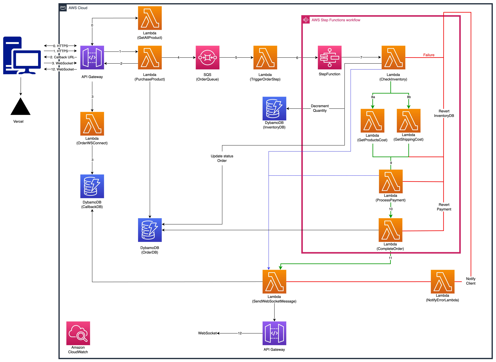
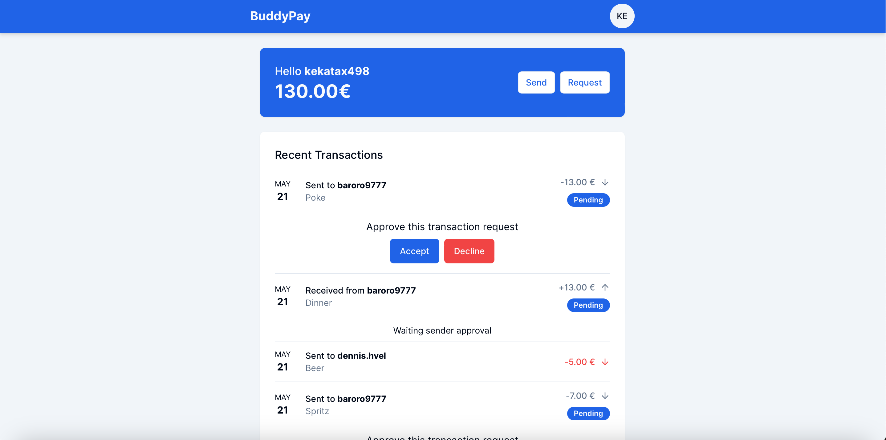

# BuddyPay
A university project about developing microservices using AWS API gateway architecture (and other AWS Cloud services) in order to support load balancing, fault tolerance, and security.

## Author
- Tommaso Romano (mat. 27290A)

## Diagram flow

    </img>

## Report
[ 🔗 Report](https://docs.google.com/document/d/1mAoJrbeC6Ofb5oI7kAnOz4sQ7p2xFH_dBt_uP6B8EJ4/edit?usp=sharing)

## Presentation
[ 🔗 Presentation]()

## Live Demo
[ 💻 buddypay.tommasoromano.com](https://buddypay.tommasoromano.com)

    </img>

## Tech Stack
### Backend (Serverless / Cloud)
- AWS API Gateway
- AWS Cognito
- AWS Lambda
- AWS SQS
- AWS DynamoDB

### Frontend
- Next.js
- Typescript
- Tailwind.css
- shadcn/ui (Radix UI)
- AWS SDK (Cognito)
